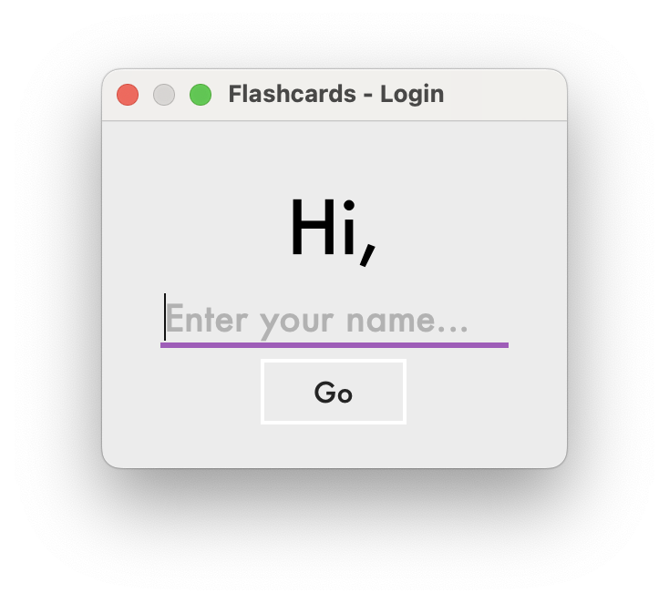
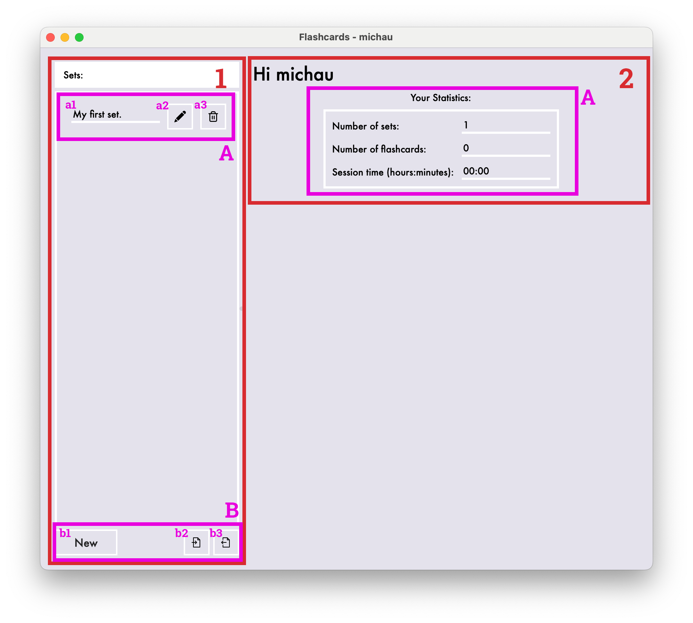
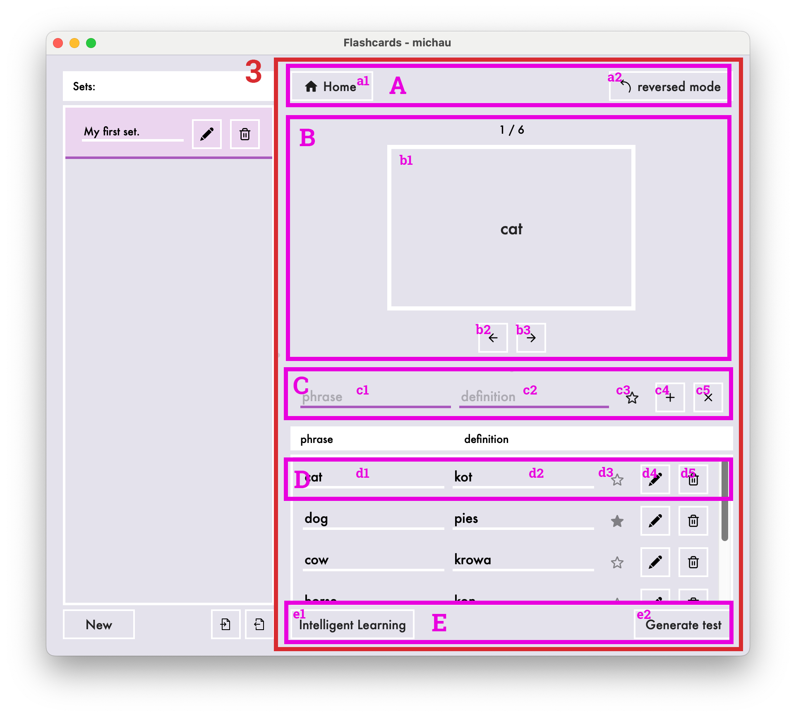
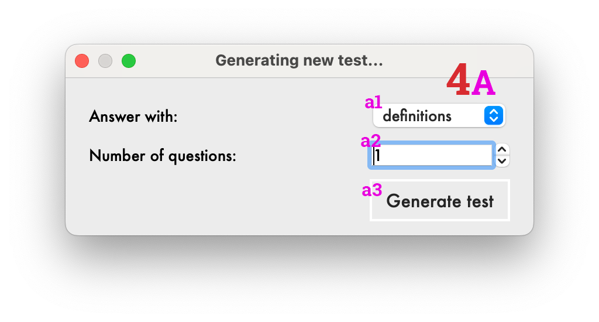
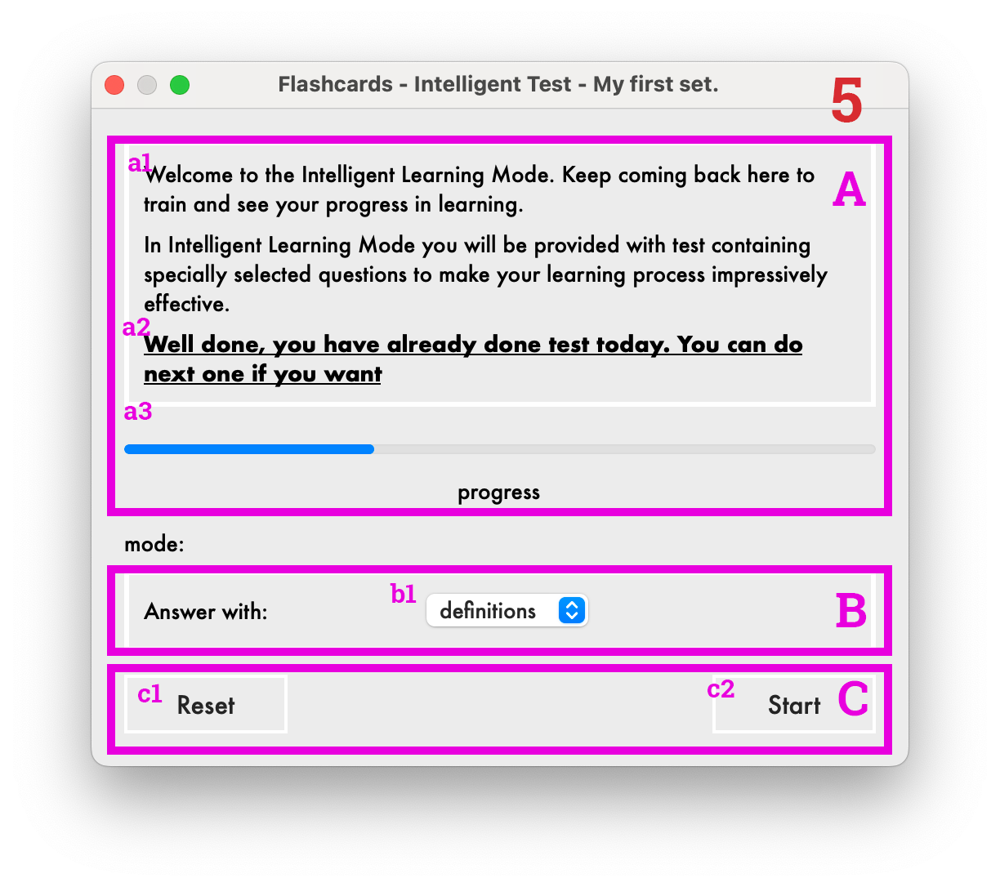
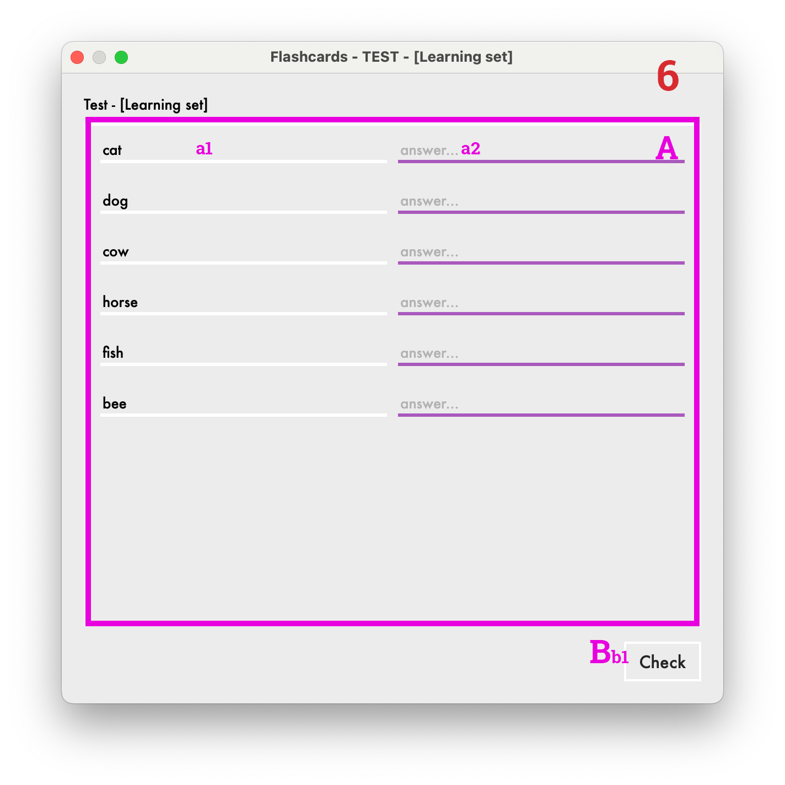
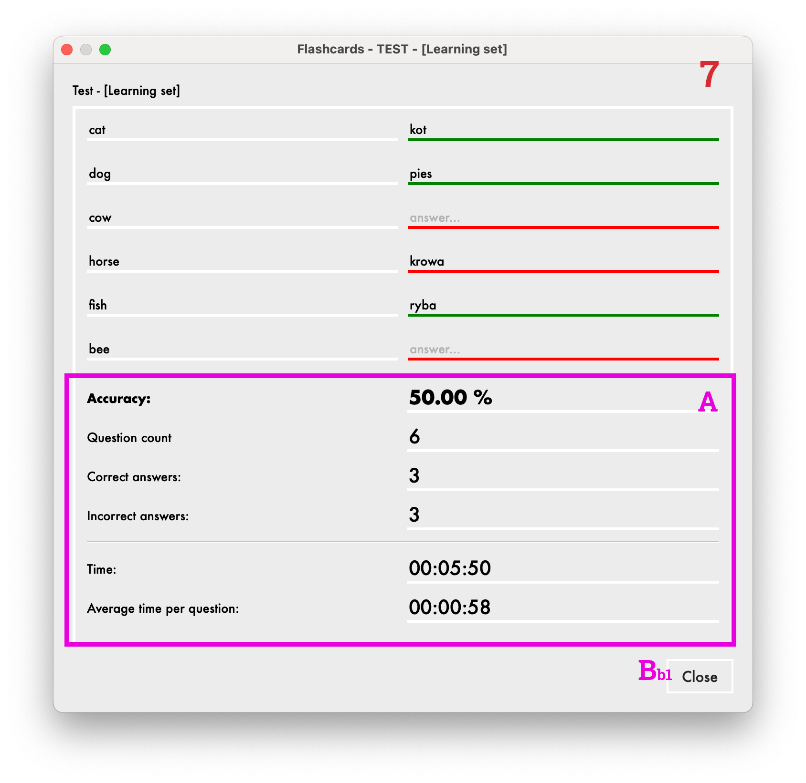

# 1. Informacje

## Dane autora projektu
* imie i nazwisko: **Michał Gryglicki**
* nr indeksu: **331380**
* uczelnia: **Politechnika Warszawska**
* wydział: **Elektroniki i Technik informacyjnych**
* kierunek: **Informatyka**
* semestr: **2023 zimowy**
* przedmiot: **Podstawy Informatyki i Programowania**

## Założenia projektu
### Tematem projektu jest realizacja elektronicznej wersji fiszek, na których umiescza się słowa w dwóch językach. Aplikacja ma mieć następujące funkcjonalności:
* definiowanie fiszek
* importowanie oraz eksportowanie fiszek
* zarządzanie fiszkami (ustawienie priorytetu, usunięcie),
* planowanie czasu testów
* przeprowadzenie testu z predefiniowaną liczbą fiszek
* wygenerowanie statystyk dotyczących efektów nauki
* wygenerowanie statystyk dotyczących korzystania z aplikacji

# 2. Realizacja

## Struktura projektu
### Projekt został podzielony na następujące moduły:
1. moduł interfejsu graicznego [flashcards_gui.py](flashcards_gui.py)
2. moduł logiki aplikacji [flashcards_logic.py](flashcards_logic.py)
3. moduł obsługi wejścia i wyjścia [flashcards_io.py](flashcards_io.py)

### 1. Moduł interfejsu graficznego
#### 1.1. Opis
Odpowiada za komunikacje między uzytkownikiem a logiką programu. inicjalizuje okno aplikacji oraz sesję. Interakcja z konkretnym elementem interfejsu przez uzytkowinka powoduje przekazanie informacji do logiki aplikacji a następnie, po przetworzeniu zmian, zwraca odpowiedni komunikat klientowi.

#### 1.2. Biblioteki
Moduł korzysta z następujących bibliotek
* wbudowane biblioteki Pythona:
    * **sys**
    * **typing** - obsługa statycznego typowania (type hints)
* zewnętrzne biblioteki:
    * **PySide6** - obsługa interfejsu graficznego (GUI)
* własne bibliotek:
    * **[biblioteka interfejsu](lib/ui)**
        * [ikony](lib/ui/icons/)
        * [moduł własnych okien dialogowych](lib/ui/dialogs.py)
        * [moduł własnych podstawowych widżetów](lib/ui/widgets_basic.py)
        * [moduł własnych zaawsowanych widżetów](lib/ui/widgets.py)
        ----
        * [główny moduł konfiguracyjny głównego okna aplikacji](lib/ui/flashcards_ui.py) - wykonany z wykorzystaniem oprogramowania z biblioteki **PySide6**. Wykorzystuje funkcjonalność **kaskadowych arkuszy stylów (CSS)**, dzięki temu interfejs graficzny jest spójny graficznie.
        * [moduły konfiguracyjne widżetów oraz okien dialogowych ](lib/ui/widgets_ui/) - wykonanych z wykorzystaniem oprogramowania z biblioteki **PySide6**
    * **[biblioteka logiki gry](flashcards_logic.py)** - do obsługi zachowań użytkownika
    * **[resources_rc](resources_rc.py)** - biblioteka zasobów interfejsu graficznego

#### 1.3. Opis klas
Plik zawiera jedną klasę FlaschcardWindow odpowiedzialną za obsługę głównego okna aplikacji.
Dokładny opis klasy oraz metod znajduje się w docstring-ach w **[kodzie źródłowym modułu](flashcards_gui.py)**

### 2. Moduł logiki aplikacji
#### 2.1. Opis
Odpowiada za dostarczanie funkcjonalności programu. Obsługuje zapytania wysyłane przez moduł interfejsu użytkownika.

#### 2.2. Biblioteki
Moduł korzysta z następujących bibliotek:
* biblioteki wbudowane Pythona
    * **__future__** - do wykorzystania pełnej funkcjonalność statycznego typowania w kodzie
    * **random** - obsługa losowania obieków
    * **time** - obsługa pomiaru czasu
* biblioteki własne
    * **[biblioteka własnych wyjątków](lib/errors.py)**
#### 2.3. Opis klas
* **Flashcard** - przechowuje informacje o pojedynczej fiszce (daną frazę, definicję oraz priorytem)
* **FlashcardsSet** - przechowuje zbiór fiszek (Flashcards) o danej nazwie
* **TestItem** - reprezentuje jedno zadanie testowe (pytanie)
* **Test** - reprezentuje zbiór zadań testowych (TestItem)
* **TestResult** - reprezentuje wynik testu (Test)
* **Session** - przechowuje informacje o aktualnej sesji użytkownika - ta klasa obsługuje zapytania kierowane przez zalogowanego użytkownika
* **SessionStats** - przechowuje statystyki aktualnej sesji (Session) tworzy się automatycznie przy inicjacji sesji

Szczegółowy opis klas oraz ich metod znajduje się w docstringach w [kodzie źródłowym modułu](flashcards_logic.py)

### 3. Moduł obsługi wejścia i wyjścia
#### 3.1. Opis
Moduł odpowiada za komunikację programu z zewnętrznymi danymi.

#### 3.2. Biblioteki
Moduł korzysta z następujących bibliotek:
* biblioteki wbudowane Pythona
    * **typing** - obsługa statycznego typowania (type hints)
    * **os.path** - obsługa operacji na ścieżkach
    * **csv** - obsługa serializacji danych do pliku csv
* biblioteki własne
    * **lib.errors** - obsługa własnych wyjątków
    * **flashcards_logic** - połączenie z modułem logiki

#### 3.3. Opis klas
* **Import** - obiekt importu w tym obiekcie są ładowane oraz interpretowane dane z zewnętrznego źródła
* **Export** - obiekt eksportu, w tym obiekcie dane programu są zachowywane w zewnętrznym źródle

Szczegółowy opis klas oraz ich metod znajduje się w docstringach w [kodzie źródłowym modułu](flashcards_logic.py)

## Testowanie
Projekt obejmuje **100 testów jednostkowych** sprawdzających kluczowe funkcjonalności. Moduły został także przetestowane pod kątem możliwych błędów.
* [testy jednostkowe modułu logiki](tests/test_flashcards_logic.py)
* [testy jednostkowe modułu obsługi wejścia i wyjścia](tests/test_flashcards_io.py)

# 3. Funkcjonalności
### 1. Krytyczne
* definiowanie fiszek
* import / export fiszek do pliku csv
* Zarządzanie fiszkami (ustawienie priorytetu, usunięcie)
* przeprowadzenie testu z predefiniowaną liczbą fiszek
* wygenerowanie statystyk dotyczących efektów nauki
* planowanie czasu testów (Intelligent Learning)
* wygenerowanie statystyk dotyczących korzystania z aplikacji
* Implementacja 'spaced repetition' (Intelligent Learning)

### 2. Dodatkowe
* rozbudowany interfejs graficzny
* podział fiszek na zestawy
* Zzrządzenie zestawami (zmiana nazwy, usuwanie)
* możliwość przeglądania fiszek w odwróconej formie
* generowanie testu z możliwością wyboru rodzaju odpowiedzi
* wyświetlanie postępu w nauce

# 4. Instrukcja obsługi

## Uruchomienie:
### Wymagania:
- Python: 3.12.0 wraz z pakietami z pliku [requirements.txt](requirements.txt)
### Uruchomienie:
- Aby uruchomić program należy uruchomić plik [flashcards_gui.py](flashcards_gui.py)
- **UWAGA: OKNO STARTOWE MOŻE ZNAJDOWAĆ SIĘ POD INNYMI OKNAMI**

## Interfejs:
### 1. [Ekran logowanie](documentation_attachments/Flashcard_login.png)
Pobiera nazwę użytkownika potrzebną do rozpoczęcia sesji

### 2. [Strona główna](documentation_attachments/flashcards_homepage.png)
Wyświetla się po rozpoczęciu sesji

#### 1. Sekcja zarządzania zestawami fiszek
* A - reprezentacja pojedynczego zestawu fiszek kliknięcie powoduje otwarcie strony zestawu.
    * a1 - nazwa zestawu
    * a2 - przycisk zmiany nazwy zestawu
    * a3 - przycisk usunięcia zestawu
* B - zarządzanie zestawami
    * b1 - przycisk utworzenia nowego zestawu
    * b2 - przycisk importu zestawu z pliku csv
    * b3 - przycisk eksportu zestawu do pliku csv

#### #2. Ekran powitalny
powitanie użytkownika oraz wyświetlenie statystyk jego sesji
* A - wyświetlanie statystyk sesji

### 3.[Strona zestawu](documentation_attachments/flashcard_setpage.png)
Po kliknięciu w element listy zestawów fiszek (1-A) Wyświetla aktualnie otwarty zestaw fiszek.

* A - sekcja przycisków górnych
    * a1 - przycisk powrotu do strony głównej
    * a2 - przycisk włączania odwróconego trybu (zamiana wyświetlania frazy i definicji)
* B - galeria (slider) fiszek
    * b1 - przycisk fiszki
    * b2 - przycisk otwarcia poprzedniej fiszki
    * b3 - przycisk otwarcia kolejnej fisszki
* C - widżet tworzenia nowej fiszki
    * c1 - pole frazy
    * c2 - pole definicji
    * c3 - ustawianie priorytetu
    * c4 - przycisk dodani fiszki do zestawu
    * c5 - przycisk wyczyszczenia pól widżeta
* D - element listy fiszek
    * d1 - pole frazy
    * d2 - pole definicji
    * d3 - przycisk edycji fiszki
    * d4 - przycisk edycji/zapisu
    * d5 - przycisk usunięcia fiszki z zestawu
* E - sekcja testów
    * e1 - przycisk uruchomiania trybu inteligentnej nauki
    * e2 - przycisk generowania testu

### 4. [Okno generwania testu](documentation_attachments/flashcards_test_generate.png)
Po kliknięciu przycisku generowania testu (3-E-e2), wyświetla okno dialogowe odpowiadające za generowanie testu.

* A - widżet generowania testu
    * a1 - pole wyboru rodzaju oczekiwanych odpowiedzi w teście
    * a2 - liczba zadań
    * a3 - przyczisk uruchomienia testu

### 5. [Okno startu Intelligent Learning](documentation_attachments/flashcards_intelligent_learning.png)
Po kliknieciu przycisku uruchomienia trybu inteligentnej nauki (3-E-e1) wyświetla okno startowe trybu inteligentnej nauki

* A - sekcja informacyjna
    * a1 - opis trybu
    * a2 - pole informujące o aktualnym stanie nauki
    * a3 - pasek postępu w nauce
* B - tryb testu
    * b1 - pole wyboru rodzaju oczekiwanych odpowiedzi w teście
* C - sekcja zarządzania nauką
    * c1 - przycisk resetowania postępów w nauce
    * c2 - przycisk uruchomienia testu

### 6. [Okno testu](documentation_attachments/flashcards_test.png)
Po kliknięciu przycisków generowania testów (5-C-c2) lub (4-A-a3) wyświetlany okno testu

* A - sekcja zadań
    * a1 - pole pytania
    * a2 - pole odpowiedzi
* B
    * b1 - przycisk sprawdzania odpowiedzi

### 7. [okno wyników testu](documentation_attachments/flashcards_test_results.png)
Po kliknięciu przycisku sprawdzenia testu (6-B-b1) wyświetla się wynik testu.

* A - sekcja statystyk
* B
    * b1 - przycisk zamknięcia okna

## Pliki wejściowe importu
### 1. Program umożliwia importowanie fiszek z pliku csv.
Wymagane nagłówki to

    phrase,definition,priority,learning_cup

gdzie:
* `phrase` - fraza fiszki (1-50 znaków)
* `definition` - definicja fiszki (1-50 znaków)
* `priority` - priorytwe fiszki (True, False)
* `learning_cup` - fraza fraszki (0, 1, 2, 3 - skala od 0 do 3 gdzie 0 oznacza, że użytkownik "nie umie fiszki" a 3, że "doskonale umie")

**[Przykładowy plik](tests/test.csv)**
# 5. Refleksje
Projekt okazał się bardzo ciekawy i rozwijający. Konieczność samodzielnego szukania rozwiącań celem uzyskania założonego efektu sprawiła, że zdobyłem dużo nowych umiejętności. Udało mi się zrealizować wszystkie funkcjonalności krytyczne, dalszy rozwój projektu może obejmować następujące funkcjonalności:

* zapis całej sesji - profilu użytkownika - i ponownego uruchomienia aplikacji bez koniczności importowania zestawów
* wyświetlanie tylko wyróżnionych fiszek
* sortowanie, losowanie fiszek
* inne rodzaje zadań testowych
* wypisanie poprawnych odpowiedzi w wynikach testu
